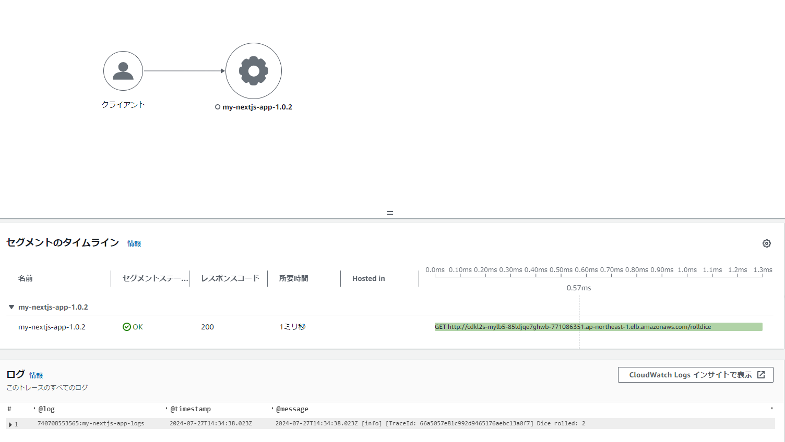
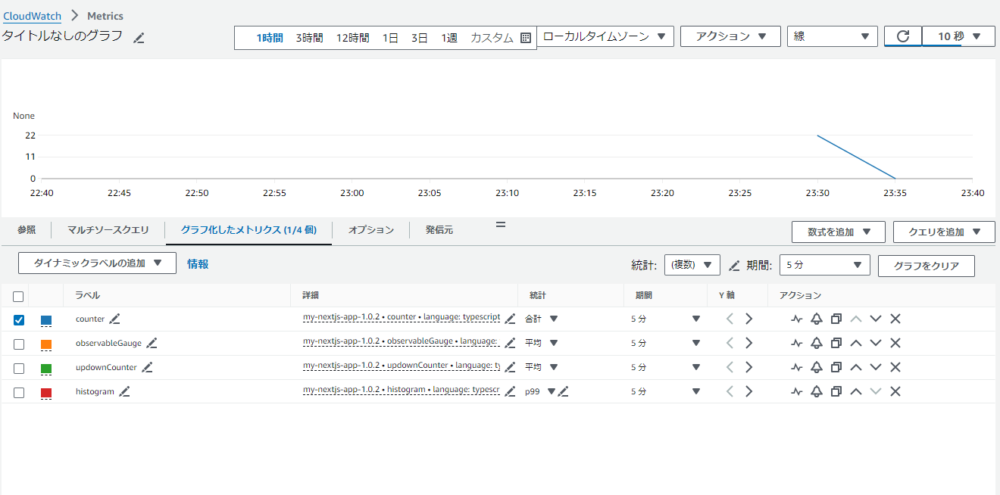

# プロジェクト概要

AWS Distro for OpenTelemetry (ADOT) を使用してメトリクス、トレース情報を収集し、AWS CloudWatchおよびX-Rayで計装を確認します。
インフラはCDKで構築します。

## フォルダ構成

以下は各フォルダの説明です。

| フォルダ名 | 説明 |
|------------|------|
| adot       | ADOTの設定ファイルとDockerfileが含まれています。 |
| app2       | アプリケーションのソースコードとDockerfileが含まれています。 |
| cdkL2      | CDKレベル2のスタック定義が含まれています。 |
| cdkL3      | CDKレベル3のスタック定義が含まれています。 |

## 展開手順

### 1. `upload_image.ps1` の説明と実行

`upload_image.ps1` は、DockerイメージをAWS ECRにプッシュするためのスクリプトです。

```powershell
# DockerビルドとECRへのプッシュ
./upload_image.ps1
```

### 2. CDKのデプロイ手順

CDKをデプロイするためには、以下のツールが必要です：

- Node.js
- TypeScript
- AWS CDK

これらがインストールされていない場合、以下のコマンドでインストールしてください：

```sh
# Node.jsのインストール (必要な場合)
https://nodejs.org/ からインストール

# TypeScriptのインストール
npm install -g typescript

# AWS CDKのインストール
npm install -g aws-cdk
```

次に、プロジェクトの依存関係をインストールします：

```sh
# cdkL2の依存関係をインストール
cd cdkL2
npm install

# cdkL3の依存関係をインストール
cd ../cdkL3
npm install
```

### 3. CDKのデプロイ手順

cdkを一度も実行していない場合、初めにcdk toolkitを作成する必要があります。

```sh
# bootstrapの実行 cdkL2,cdkL3どちらかでOK
cd cdkL2
cdk bootstrap
```


CDKスタックをデプロイするには、以下のコマンドを実行します：

```sh
# デプロイ
cd cdkL2
cdk synth
cdk diff
cdk deploy
```
※cloudwatch logs nameがcdkL2とcdkL3でバッティングしているため、どちらか一つのみ作成可能です。
```sh
# デプロイ
cd cdkL3
cdk synth
cdk diff
cdk deploy
```

### 4. CDKで構築されるAWSリソースの図示

以下は、このプロジェクトで構築されるAWSリソースの概略図です：

#### cdkL2構成図


#### cdkL3構成図


---

### 5. 動作確認 (X-Ray)

1. CDKでスタックをデプロイした後、CloudFormationのOutputsセクションに記載されているURLにアクセスします。
    - `/rolldice`: 1-5の数字がランダムで出力されます。
    - `/s3buckets`: S3バケットの一覧が出力されます。

2. CloudWatchのX-Rayコンソールに移動し、トレースおよびトレースマップを確認します。
    - トレース情報が正しく取得されていることを確認します。



### 6. 動作確認 (カスタムメトリクス)

1. CloudWatchコンソールに移動し、メトリクスセクションを開きます。
2. `my-nextjs-app-1.0.2`という名前のカスタムメトリクスが作成されていることを確認します。

